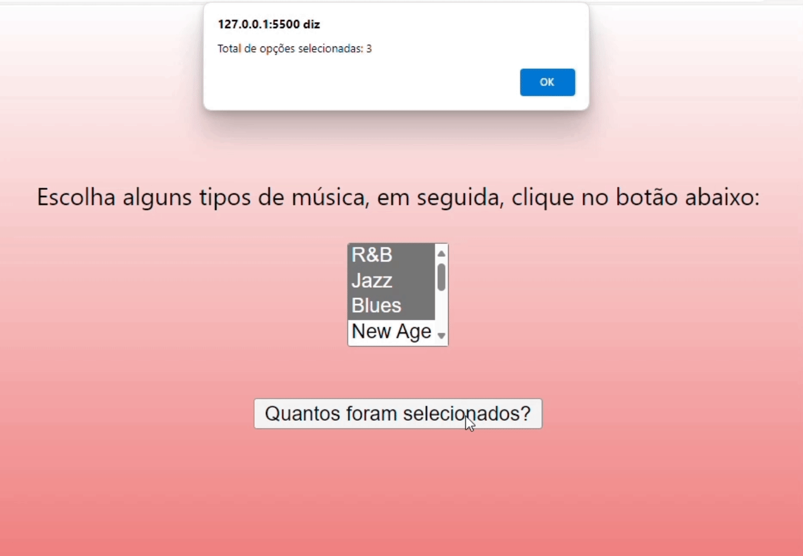

* [Introdução](#introdução)
* [Descrição](#Descrição)
* [Fontes](#fontes)
* [Resultado](#resultado)

## `Introdução`
A tarefa tem intuito de reforçar os estudos em sala sobre laços de repetição no javascript e entender como o projeto escolhido funciona.

## `Descrição`
O projeto em questão visa adicionar três novos estilos musicais ao projeto existente, proporcionando aos usuários uma variedade de opções musicais. Foi utilizado o laço "for" para que o usuário consiga selecionar um ou mais estilos musicais, caso aconteça, apererece um "alert" informando a quantidade de estilos selecionados. Além disso realizamos ajustes estilísticos no CSS para aprimorar sua estética visual.

## `Fontes`
 [*Código utilizado no projeto*](https://developer.mozilla.org/pt-BR/docs/Web/JavaScript/Guide/)

## `Resultado`

## `Autores`
* Manuela Araujo dos Santos

* https://github.com/belsil5aa

* https://github.com/camilacasagrande

* https://github.com/dudafontinele

